<h3><code>rajannishad2525@github ~ $ ./contributions.sh</code></h3>

<h3><code>rajannishad2525@github ~ $ whoami</code></h3>

<table>
<tr>
<td valign="top"></td>
<td valign="top"></td>
</tr>
</table>

  

<h3><code>~ $ cat stack.txt</code></h3>

 

## What I'm building

**[ryzenstudy.com](https://ryzenstudy.com)** — a free platform for AKTU previous year question papers.

Not just a PDF host. Every paper page carries the full question paper as searchable
text, and each one shows which of its questions have appeared in earlier sessions —
a cross-year comparison that AKTU's own PDFs don't provide.

| | |
|---|---|
| Papers | 1,447 across B.Tech, B.Pharm, MCA, BBA, BCA |
| Questions indexed | 31,321, extracted from the official PDFs |
| Repeated questions found | 3,829 across 447 subjects |
| Stack | Next.js 15, React 19, Tailwind v4, flat-file JSON, Nginx, PM2 |
| Cost to students | ₹0 — no login, no signup, no paywall |

 

## Other things I've shipped

| Project | What it does |
|---|---|
| [ToolsTresor](https://github.com/rajannishad2525/ToolsTresor) | 19+ privacy tools — QR generator, steganography, file encryption, hashing, PDF cleaner. Flask + Python. |
| [Carbon Footprint Tracker](https://github.com/rajannishad2525/carbonfootprint) | Track and reduce your personal carbon footprint. |
| [2FA Code Generator](https://github.com/rajannishad2525/2FA-Code-Generator) | Client-side TOTP generator — nothing leaves your browser. |

 

## Currently

- Grinding **DSA in Java** — arrays, strings, trees, working toward graphs and DP
- Learning **generative AI and agent workflows**, and using them on real projects
- Running a production site solo: deploys, Nginx, caching, SEO, and the 2am bugs

 

  

The graph and card above are SVGs generated from my own scripts and committed to this repo —
they render instantly and can't break when someone else's free tier runs out.
Refreshed daily by <a href="./.github/workflows/update-profile-art.yml">a GitHub Action</a>.

